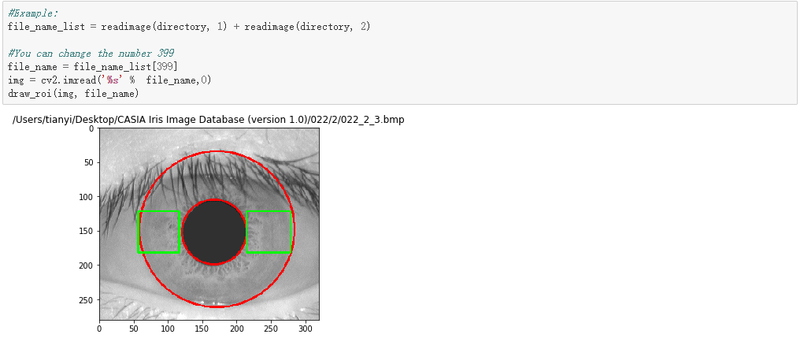
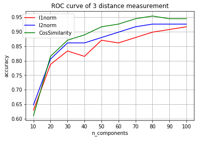

# Project: implement an iris recognition algorithm



### [Full Project Description]

Term: Fall 2018
Requirement:  
1) Implement the exact same design as Ma et al., 2003 paper (see the paper in folder /doc) but focus on Image Preprocessing, Feature Extraction, and Iris Matching only and use provided dataset.  2) Use the CASIA Iris data in folder /data  


+ Team members
	+ Pei, Yukun  yp2446@columbia.edu
	+ Zhang, Tianyi  tz2390@columbia.edu

+ Project summary: In this project, we implemented the algorithm according to the paper Ma et al., picked the most clear Iris Image, located the pupil and iris, conducted normalization and enhancement, used angular change to enrich dataset and finally achieved 95% accuracy in the iris matching task as expected.


**Contribution statement**:  Yukun Pei is in charge for the code of iris localization/normalization, conduct LDA(linear discriminant analysis) and LDA after PCA algorithm to the dataset, Tianyi Zhang is in charge of the code of pupil detection and write the paper.

Following [suggestions](http://nicercode.github.io/blog/2013-04-05-projects/) by [RICH FITZJOHN](http://nicercode.github.io/about/#Team) (@richfitz). This folder is orgarnized as follows.

```
proj/
├── lib/
├── data/ C
├── doc/
├── figs/
└── output/
```

Please see each subfolder for a README file.
